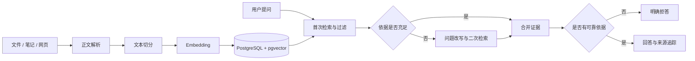

# 知屿 · Personal Knowledge Base

一个基于 Spring Boot、PostgreSQL、pgvector 和 Spring AI 的个人知识库全栈应用。用户可以收录文件、笔记和网页，并通过带来源追踪的 RAG 问答检索自己的知识。

当前版本已经完成从“资料进入知识库”到“基于证据回答”的完整闭环，并提供资料管理和知识问答 Web 页面。

## 核心能力

- 解析 TXT、Markdown、PDF 和 DOCX 文件，支持大写扩展名。
- 创建文本笔记，抓取公开网页正文。
- 按段落切分文本，并为相邻文本块保留重叠内容。
- 使用 Spring AI 生成 Embedding，写入 PostgreSQL + pgvector。
- 更新或删除资料时同步更新向量数据。
- 根据相似度检索和过滤知识片段。
- 首次检索结果不足时改写问题并执行第二次检索。
- 只根据检索证据生成回答，返回资料来源；无可靠依据时拒答。
- 提供统一的 API 异常响应。
- 提供响应式资料管理和知识问答页面。

## 业务闭环



## 技术栈

| 分类 | 技术 |
|---|---|
| 语言与构建 | Java 17、Maven 3.9+ |
| Web | Spring Boot 4.1.1、Spring Web MVC、Jakarta Validation |
| 数据 | Spring Data JPA、PostgreSQL、pgvector |
| AI | Spring AI 2.0.1、OpenAI 兼容接口 |
| 内容处理 | Apache PDFBox、Apache POI、jsoup |
| 前端 | HTML、CSS、原生 JavaScript |
| 测试 | JUnit 5、Mockito、MockMvc |

## 快速开始

### 1. 准备环境

- JDK 17 或更高版本
- Maven 3.9+
- PostgreSQL 14+
- 已安装 pgvector 的 PostgreSQL 实例
- 一个支持 OpenAI 兼容接口的模型服务密钥

### 2. 创建数据库

```sql
CREATE DATABASE personal_knowledge_base;
```

连接到该数据库后启用扩展：

```sql
CREATE EXTENSION IF NOT EXISTS vector;
```

### 3. 配置环境

在项目根目录复制示例文件：

```powershell
Copy-Item .env.example .env
```

编辑 `.env`，填写本机数据库信息和模型服务密钥。`.env` 已被 Git 忽略，禁止提交真实密码和 API Key。

### 4. 启动应用

```powershell
mvn spring-boot:run
```

启动后访问：

- 资料管理页面：<http://localhost:8080/>
- 知识问答页面：<http://localhost:8080/chat.html>
- 健康检查：<http://localhost:8080/api/health>

更完整的数据库、环境变量、测试、打包和故障排查说明见 [运行说明](docs/RUNNING.md)。

## API 概览

| 方法 | 路径 | 功能 |
|---|---|---|
| `GET` | `/api/health` | 健康检查 |
| `POST` | `/api/documents` | 上传文件 |
| `POST` | `/api/documents/notes` | 创建笔记 |
| `POST` | `/api/documents/links` | 抓取并收藏网页 |
| `GET` | `/api/documents` | 查询资料列表 |
| `PUT` | `/api/documents/{id}` | 更新资料正文和向量 |
| `PUT` | `/api/documents/{id}` | 使用新文件替换资料，提交 multipart/form-data |
| `DELETE` | `/api/documents/{id}` | 删除资料及其向量 |
| `POST` | `/api/chat` | 基于知识库进行问答 |

问答示例：

```powershell
Invoke-RestMethod -Method Post `
  -Uri http://localhost:8080/api/chat `
  -ContentType "application/json" `
  -Body '{"question":"我的资料中介绍了哪些文件格式？"}'
```

## 测试与打包

运行全部测试：

```powershell
mvn test
```

生成可运行 JAR：

```powershell
mvn package
java -jar target/personal-knowledge-base-0.0.1-SNAPSHOT.jar
```

测试使用 Mock 替代 EmbeddingModel 和 ChatModel，不会调用真实模型；Spring 上下文测试会连接本地 PostgreSQL，因此测试前需要启动数据库并启用 `vector` 扩展。

## 项目结构

```text
src/main/java/com/ithwx/personalknowledgebase
├── controller/     HTTP 接口
├── dto/            请求与响应模型
├── entity/         JPA 实体
├── exception/      统一异常处理
├── repository/     数据访问
└── service/        解析、切分、入库、检索与回答

src/main/resources
├── application.yaml
└── static/         资料管理与问答页面
```

详细类职责和模块依赖见 [模块拆分文档](docs/MODULES.md)。

## 设计与文档

- [项目设计文档](docs/PROJECT_DESIGN.md)
- [模块拆分文档](docs/MODULES.md)
- [运行说明](docs/RUNNING.md)
- [用户故事](docs/USER_STORIES.md)
- [MIT License](LICENSE)

## 安全说明

- `.env` 只保存在本地，仓库仅提交无真实凭据的 `.env.example`。
- 网页抓取只接受公开 HTTP/HTTPS 地址，并拒绝本机、内网、链路本地和组播地址。
- 前端使用文本节点展示模型回答和来源，避免把模型内容直接注入 HTML。
- 未知服务器异常只返回通用信息，不向客户端泄露堆栈和内部配置。
- 本项目是单用户学习项目，尚未实现登录、授权和多用户数据隔离，不应直接作为公网多用户服务部署。

## 开发流程

项目采用 Issue 驱动开发：总 Issue 描述完整范围，模块子 Issue 对应独立分支，每个 PR 使用 `Closes #Issue编号` 建立关联，通过检查后再合并到 `main`。

项目总任务记录在 GitHub Issue `#1`。

## License

本项目使用 [MIT License](LICENSE)。
