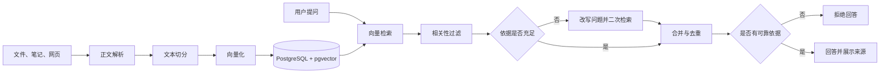

# Personal Knowledge Base

一个计划基于 Spring Boot、PostgreSQL、pgvector 和 Spring AI 实现的个人知识库全栈应用。

> 当前状态：项目骨架与健康检查已经完成，其他业务模块将按照 Issue 逐步实现。

## 项目背景

个人的课程资料、笔记和网页收藏通常分散在不同位置。资料不断积累后，传统文件夹和收藏夹难以支持快速检索和知识复用。

本项目希望建立一套完整流程，让用户能够统一收录资料，并通过自然语言从知识库中获取带有来源依据的回答。

## 项目目标

计划实现以下完整业务闭环：

```text
上传文件 / 创建笔记 / 收藏网页
    → 正文解析
    → 文本切分
    → Embedding 向量化
    → PostgreSQL + pgvector 入库
    → 用户提问
    → 检索与过滤
    → 必要时改写问题并二次检索
    → 回答、来源展示或无依据拒答
```

## 核心功能规划

- 收录 PDF、TXT、Markdown 和 DOCX 文件。
- 创建纯文本笔记。
- 抓取公开网页正文。
- 查看、更新和删除资料。
- 将资料切分、向量化并写入 pgvector。
- 基于知识库内容进行 RAG 问答。
- 首次检索不足时改写问题并二次检索。
- 返回回答使用的资料和原文片段。
- 知识库没有可靠依据时拒绝回答。
- 资料更新和删除后同步更新向量数据。
- 提供 Web 管理和问答页面。

## 用户流程



## 技术栈

| 类型 | 计划使用的技术 |
|---|---|
| 开发语言 | Java 17 |
| 后端框架 | Spring Boot |
| Web | Spring Web MVC |
| 参数校验 | Jakarta Validation |
| 数据访问 | Spring Data JPA |
| 关系型数据库 | PostgreSQL |
| 向量存储 | PostgreSQL + pgvector |
| AI 接入 | Spring AI |
| 项目管理 | Maven |
| 前端 | HTML、CSS、JavaScript |
| 测试 | JUnit 5、Mockito |
| API 文档 | OpenAPI、Swagger |
| CI | GitHub Actions |

## 模块划分

| 模块 | 职责 |
|---|---|
| 项目骨架 | 基础配置、环境变量、健康检查 |
| 数据模型 | 资料元数据建模与 PostgreSQL 持久化 |
| 文档解析 | PDF、TXT、Markdown、DOCX 正文提取 |
| 网页抓取 | 安全访问公开网页并提取正文 |
| 文本切分 | 段落切分、重叠内容和超长文本处理 |
| 向量入库 | Embedding 生成、保存、更新和删除 |
| 资料管理 | 文件、笔记、网页的增删改查 |
| RAG 问答 | 检索、过滤、查询改写、回答和溯源 |
| 前端页面 | 资料管理、问答和来源展示 |
| 测试与交付 | 自动化测试、运行文档和 CI |

## 计划接口

| 方法 | 路径 | 说明 |
|---|---|---|
| `GET` | `/api/health` | 应用健康检查 |
| `POST` | `/api/documents` | 上传文件 |
| `POST` | `/api/documents/notes` | 创建笔记 |
| `POST` | `/api/documents/links` | 收藏网页 |
| `GET` | `/api/documents` | 查询资料列表 |
| `PUT` | `/api/documents/{id}` | 更新资料 |
| `DELETE` | `/api/documents/{id}` | 删除资料 |
| `POST` | `/api/chat` | 知识库问答 |

以上接口目前属于设计方案，将按照模块 Issue 逐步实现。

## 项目范围

当前版本计划包含：

- 单用户知识库
- 文件、笔记和网页收录
- 资料管理
- RAG 问答与来源追踪
- 简单 Web 前端

当前版本暂不包含：

- 用户注册和权限系统
- 多租户
- OCR
- 图片、音频和视频解析
- 文档版本历史
- 大规模异步任务
- 移动端应用

## 开发流程

项目采用 Issue 驱动方式开发：

1. 在总 Issue 中定义产品范围与模块。
2. 每个模块建立独立子 Issue。
3. 每个功能从 `main` 创建独立分支。
4. 完成功能和测试后创建 PR。
5. PR 使用 `Closes #Issue编号` 关联对应 Issue。
6. PR 通过检查后合并到 `main`。

总功能设计记录在 GitHub Issue `#1`。

## 文档

- [用户故事](docs/USER_STORIES.md)

后续将继续补充：

- 项目设计文档
- 模块拆分文档
- API 文档
- 运行说明

## 本地运行

### 环境要求

- JDK 17
- Maven 3.9+
- PostgreSQL

### 创建数据库

```sql
CREATE DATABASE personal_knowledge_base;
```

连接到 `personal_knowledge_base` 数据库后，启用 pgvector 扩展：

```sql
CREATE EXTENSION IF NOT EXISTS vector;
```

检查扩展是否启用成功：

```sql
SELECT extname, extversion
FROM pg_extension
WHERE extname = 'vector';
```

### 配置环境变量

复制示例配置：

```powershell
Copy-Item .env.example .env
```

修改 `.env` 中的数据库密码和 SiliconFlow API 密钥：

```properties
DB_URL=jdbc:postgresql://localhost:5432/personal_knowledge_base
DB_USERNAME=postgres
DB_PASSWORD=replace-with-your-database-password

SILICONFLOW_API_KEY=replace-with-your-api-key
SILICONFLOW_BASE_URL=https://api.siliconflow.cn/v1
EMBEDDING_MODEL=BAAI/bge-m3
EMBEDDING_DIMENSIONS=1024
```

`.env` 已被 Git 忽略，不要把真实密码提交到仓库。

应用启动时会初始化 `vector_store` 表。单元测试会使用 Mock Embedding 模型，
不会向真实模型服务发送请求。

### 启动应用

```powershell
mvn spring-boot:run
```

### 健康检查

访问：

```text
http://localhost:8080/api/health
```

预期响应：

```json
{
  "status": "UP",
  "application": "personal-knowledge-base"
}
```

### 运行测试

```powershell
mvn test
```
