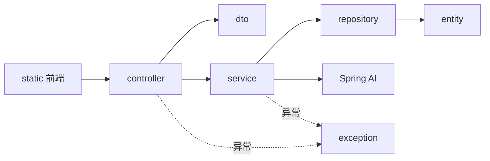

# 模块拆分文档

## 1. 模块总览

项目按职责分为接口层、业务层、数据层、模型边界、异常处理和前端六个部分。



## 2. Controller 模块

路径：`src/main/java/com/ithwx/personalknowledgebase/controller`

| 类 | 路径 | 职责 | 主要依赖 |
|---|---|---|---|
| `HealthController` | `/api/health` | 返回应用存活状态和名称 | 应用配置 |
| `DocumentController` | `/api/documents` | 文件、笔记、网页的创建、列表、更新和删除 | `DocumentManagementService` |
| `ChatController` | `/api/chat` | 校验用户问题并返回 RAG 结果 | `RagAnswerService` |

Controller 不实现解析、检索等业务规则，只负责协议转换和调用服务。

## 3. DTO 模块

路径：`src/main/java/com/ithwx/personalknowledgebase/dto`

### 3.1 请求 DTO

| 类 | 用途 | 关键校验 |
|---|---|---|
| `NoteCreateRequest` | 创建笔记 | 标题、正文非空；标题不超过 255 字符 |
| `LinkCreateRequest` | 收藏网页 | URL 非空；可选标题不超过 255 字符 |
| `DocumentUpdateRequest` | 更新资料 | 名称、正文非空；名称不超过 255 字符 |
| `ChatRequest` | 提交问题 | 问题非空且不超过 1000 字符 |

### 3.2 响应和内部传输 DTO

| 类 | 职责 |
|---|---|
| `HealthResponse` | 健康检查结果 |
| `DocumentResponse` | 资料列表和写操作结果 |
| `WebPage` | 网页抓取后的 URL、标题和正文 |
| `RetrievedChunk` | 一个经过过滤的向量检索结果 |
| `TwoStageRetrievalResult` | 两阶段检索结果和检索轨迹 |
| `AnswerSource` | 去重后的回答来源 |
| `RagAnswerResult` | 最终回答、拒答状态、检索轨迹和来源 |
| `ApiErrorResponse` | 统一 API 错误结构 |

DTO 使用 Java Record 表达不可变的数据载体。包含集合的 Record 在构造时复制集合，避免外部继续修改。

## 4. 资料处理模块

### 4.1 DocumentManagementService

资料管理门面，连接 HTTP 入口与底层处理服务。

主要职责：

- 检查上传文件和文件名。
- 统一处理大写、混合大小写扩展名。
- 调用 `DocumentParserService` 解析文件。
- 调用 `WebContentService` 抓取网页。
- 调用 `KnowledgeIngestionService` 创建或替换资料。
- 查询资料列表。
- 删除向量后删除资料记录。

### 4.2 DocumentParserService

| 格式 | 实现 |
|---|---|
| TXT | 按 UTF-8 读取字节 |
| Markdown | 按 UTF-8 读取，保留 Markdown 原文 |
| PDF | Apache PDFBox `PDFTextStripper` |
| DOCX | Apache POI 读取段落 |

不支持的扩展名会抛出 `IllegalArgumentException`，最终转换成 HTTP 400。

### 4.3 WebContentService

负责校验 URL、执行 HTTP 请求并提取正文。

- 只允许 HTTP 和 HTTPS。
- 禁止包含用户信息的 URL。
- DNS 解析后拒绝私有或本机地址。
- 不自动跟随重定向。
- 限制连接时间、请求时间和响应大小。
- 对 HTML 优先提取 `main`、`article` 或 `[role=main]`。
- 移除脚本、样式、导航、页脚等噪声节点。
- 支持 `text/html` 和 `text/plain`。

### 4.4 ChunkingService

负责把长文本转换成适合向量检索的文本块。

输入是正文字符串，输出是不可变文本块列表。算法先标准化段落空行，再从当前位置寻找最大长度内最近的段落边界；找不到合适边界时硬切，并从上一个结束位置向前回退 `overlap-chars` 形成重叠。

## 5. 入库与同步模块

### 5.1 KnowledgeIngestionService

依赖：

- `ChunkingService`
- `DocumentRepository`
- Spring AI `VectorStore`

创建资料：

```text
校验并标准化输入
→ 计算 SHA-256
→ 切分正文
→ 保存 PROCESSING 元数据
→ 构建带 metadata 的 Spring AI Document
→ VectorStore.add
→ 更新 READY 和文本块数量
```

更新资料：

```text
准备新内容
→ 更新关系元数据
→ 按 documentId 删除旧向量
→ 写入新向量
→ 更新状态和文本块数量
```

删除资料：

```text
按 documentId 删除向量
→ 删除 document 记录
```

向量写入异常时资料被标记为 `FAILED`，并向上抛出安全包装后的状态异常。

## 6. RAG 模块

RAG 调用链：

```text
ChatController
└── RagAnswerService
    └── TwoStageRetrievalService
        ├── RagRetrievalService
        │   └── VectorStore
        └── QuestionRewriteService
            └── ChatModel
    └── ChatModel
```

### 6.1 RagRetrievalService

- 根据 `top-k` 和 `similarity-threshold` 构造 `SearchRequest`。
- 调用 VectorStore 相似度检索。
- 再次过滤空正文、空分数和低相似度结果。
- 从 metadata 映射资料信息。
- 按相似度降序返回不可变列表。

### 6.2 QuestionRewriteService

在首次结果不足时使用 ChatModel 将问题改写为独立检索问题。它只返回改写文本，不负责回答。模型失败、空结果会转换成空 Optional，让上层安全降级。

### 6.3 TwoStageRetrievalService

- 执行首次检索。
- 命中数达到 `retry-min-hits` 时直接返回。
- 否则改写问题并最多执行一次额外检索。
- 合并两次结果，以资料 ID 和块序号去重。
- 保留高分结果、降序排列并限制最终数量。
- 返回原问题、改写问题和是否二次检索。

### 6.4 RagAnswerService

- 没有证据时直接拒答，不调用最终回答模型。
- 有证据时构建只允许依据上下文回答的 Prompt。
- 返回回答和去重后的资料来源。
- 模型失败或空回答时返回安全的不可用结果。

## 7. 数据访问模块

### 7.1 DocumentEntity

映射 PostgreSQL `document` 表，保存资料名称、类型、URL、哈希、时间、状态和文本块数量。`filePath` 为后续本地文件持久化预留字段，当前上传内容解析后不保存原文件。

### 7.2 DocumentRepository

继承 `JpaRepository<DocumentEntity, Long>`，获得基础 CRUD，并提供按上传时间倒序查询全部资料的方法。

### 7.3 PgVectorStore

由 Spring AI Starter 自动配置。应用启动时检查并初始化 `vector_store`，使用 HNSW 索引和余弦距离。EmbeddingModel 在 `VectorStore.add` 和相似度搜索时被调用。

## 8. 异常处理模块

路径：`src/main/java/com/ithwx/personalknowledgebase/exception`

| 类 | 职责 |
|---|---|
| `ResourceNotFoundException` | 表示资料不存在，映射为 HTTP 404 |
| `GlobalExceptionHandler` | 将校验、参数、请求体、文件和未知异常转换成统一 JSON |

未知异常会记录到服务端日志，但客户端只收到 `INTERNAL_ERROR` 和通用提示。

## 9. 前端模块

路径：`src/main/resources/static`

| 文件 | 职责 |
|---|---|
| `index.html` | 资料管理页面结构 |
| `chat.html` | 知识问答页面结构 |
| `css/app.css` | 两个页面共用样式和响应式布局 |
| `js/app.js` | 文件、笔记、网页、列表和删除操作 |
| `js/chat.js` | 问题提交、回答、来源、检索轨迹和错误展示 |

前端没有 Node.js 构建流程，所有静态文件会直接进入 Spring Boot JAR。

## 10. 测试模块

| 测试 | 覆盖范围 |
|---|---|
| `DocumentParserServiceTest` | 四种格式、中文、大写扩展名和异常格式 |
| `ChunkingServiceTest` | 空文本、段落、重叠、硬切和配置校验 |
| `WebContentServiceTest` | HTML 提取、编码、安全 URL 和大小限制 |
| `KnowledgeIngestionServiceTest` | 创建、更新、删除、metadata 和失败状态 |
| `DocumentManagementServiceTest` | 三种入库入口和同步管理 |
| `RagRetrievalServiceTest` | 检索配置、过滤、映射和排序 |
| `QuestionRewriteServiceTest` | 改写、规范化和模型异常 |
| `TwoStageRetrievalServiceTest` | 重试、去重、排序和限量 |
| `RagAnswerServiceTest` | 证据回答、来源去重、拒答和模型异常 |
| Controller 测试 | API JSON、校验和状态码 |
| `RagFlowTest` | 从 HTTP 到两阶段检索和回答的跨层闭环 |
| `GlobalExceptionHandlerTest` | 400、404、500 和错误脱敏 |
| `PersonalKnowledgeBaseApplicationTests` | Spring 容器、数据库表和页面入口 |
| `StaticResourceTest` | 静态页面和脚本关键能力 |
