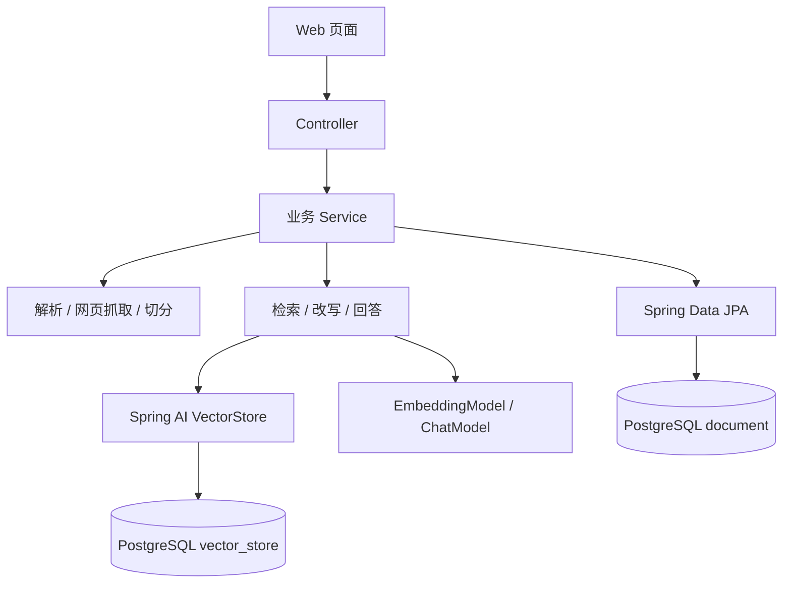
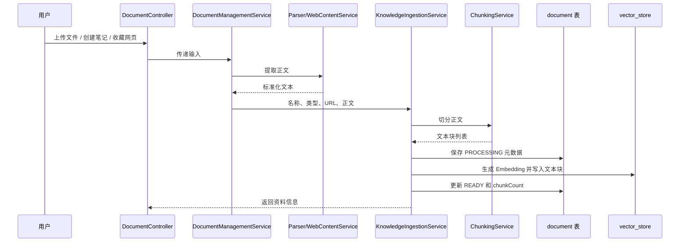
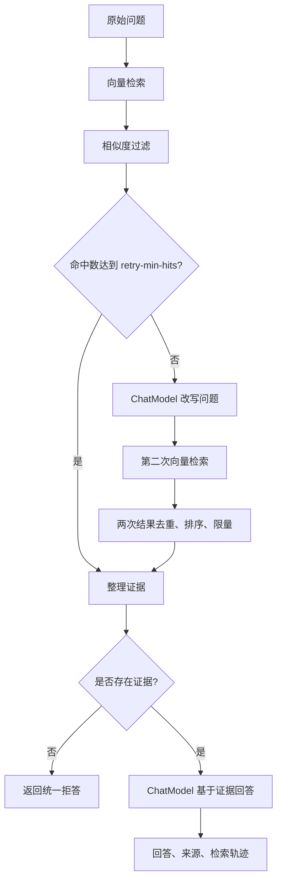

# 项目设计文档

## 1. 项目定位

知屿是一个单用户个人知识库应用，用于集中收录课程资料、学习笔记和公开网页，并通过检索增强生成（RAG）回答与资料相关的问题。

项目重点不是训练模型，而是搭建完整的数据链路：把原始内容处理成可检索向量，在用户提问时查找可靠证据，再约束大模型只根据证据回答。

### 1.1 目标

- 统一管理文件、笔记和网页资料。
- 支持 TXT、Markdown、PDF、DOCX 四种文件格式。
- 自动完成解析、切分、Embedding 和向量存储。
- 更新和删除资料时保持关系数据与向量数据同步。
- 提供两阶段检索、来源追踪和无依据拒答。
- 提供无需额外构建工具的 Web 使用界面。

### 1.2 当前不包含

- 用户注册、登录和多租户隔离。
- OCR、扫描 PDF、图片、音频和视频理解。
- 多轮会话记忆和聊天历史持久化。
- 文档版本管理、大规模异步任务和公网自动部署。

## 2. 总体架构

系统采用单体分层架构。HTML、CSS 和 JavaScript 由 Spring Boot 直接提供，浏览器通过 REST API 调用后端。关系元数据和向量都存储在同一个 PostgreSQL 实例中。



分层职责：

- Controller：接收 HTTP 请求、执行 DTO 校验、返回结构化结果。
- Service：承载资料管理、内容处理、向量同步和 RAG 编排。
- Repository：通过 JPA 管理 `document` 元数据。
- VectorStore：通过 Spring AI 管理 `vector_store` 文本、元数据和向量。
- 前端：调用 API 并展示资料、回答、来源和错误信息。

## 3. 资料入库设计

### 3.1 输入类型

| 类型 | 入口 | 内容来源 |
|---|---|---|
| 文件 | `POST /api/documents` | TXT、Markdown、PDF、DOCX |
| 笔记 | `POST /api/documents/notes` | 用户输入的标题和正文 |
| 网页 | `POST /api/documents/links` | 公开网页的标题和正文 |

### 3.2 处理流程



每个向量文本块携带以下元数据：

- `documentId`：所属资料 ID。
- `documentName`：资料名称。
- `sourceType`：文件扩展名、`note` 或 `web`。
- `sourceUrl`：网页原始地址，非网页为空。
- `chunkIndex`：文本块在资料中的序号。

资料正文还会计算 SHA-256，保存到 `contentHash`，用于标识内容。

### 3.3 文本切分

默认配置为每块最多 500 个字符、相邻块重叠 50 个字符。切分器优先在段落边界结束；当单个段落超过上限时执行硬切分。空文本返回空集合，入库服务会拒绝没有有效正文的资料。

### 3.4 状态与失败

资料状态包括：

- `PROCESSING`：元数据已建立，正在写入向量。
- `READY`：向量写入成功，可以参与检索。
- `FAILED`：向量写入失败，`chunkCount` 重置为 0。

更新资料时先准备新内容，再删除旧向量并写入新向量；删除资料时先删除对应向量，再删除关系记录。

## 4. RAG 问答设计

### 4.1 两阶段检索



第一次检索使用：

- `top-k: 5`
- `similarity-threshold: 0.55`
- `retry-min-hits: 2`

如果第一次命中数不足，`QuestionRewriteService` 调用 ChatModel 将原问题改写成独立、适合语义检索的问题。系统最多只改写一次、最多检索两次。改写为空、与原问题相同或模型调用失败时，直接保留第一次结果。

两次结果以“资料 ID + 文本块序号”去重，保留相似度更高的结果，按相似度降序排列并限制为 `top-k` 条。

### 4.2 基于证据回答

`RagAnswerService` 把文本块编号为“证据 1、证据 2……”并放入 Prompt，明确要求模型：

- 只能根据给定知识库证据回答。
- 不得使用外部事实补全答案。
- 证据不足时返回固定拒答信息。
- 使用证据编号说明依据。

如果检索结果为空，系统不调用最终回答模型，直接返回“根据当前知识库资料，暂时无法回答这个问题”。模型异常或返回空内容时返回安全的服务不可用提示。

### 4.3 返回结果

问答响应包含：

- 原始问题和回答正文。
- `refused`：是否拒答。
- `rewrittenQuestion`：改写后的问题，未改写时为空。
- `secondSearchExecuted`：是否执行第二次检索。
- `sources`：去重后的资料 ID、名称、类型、URL 和命中文本块序号。

## 5. 数据设计

### 5.1 document 表

| 字段 | 用途 |
|---|---|
| `id` | 资料主键 |
| `name` | 资料名称 |
| `file_path` | 预留的文件路径 |
| `file_type` | 文件类型或来源类型 |
| `source_url` | 网页原始地址 |
| `content_hash` | 正文 SHA-256 |
| `upload_time` | 创建时间 |
| `status` | 处理状态 |
| `chunk_count` | 文本块数量 |

### 5.2 vector_store 表

该表由 Spring AI PgVectorStore 自动初始化，保存文本块正文、JSON 元数据和向量。向量维度必须与 Embedding 模型输出一致，当前默认是 1024。

关系表保存适合列表展示的资料元数据，向量表保存实际检索内容，两者通过向量元数据中的 `documentId` 建立逻辑关联。

## 6. 接口与错误设计

所有 API 使用 `/api` 前缀。请求 DTO 使用 Jakarta Validation 校验；业务参数错误由服务层再次校验。

错误响应统一包含：

```json
{
  "timestamp": "2026-09-04T06:36:00Z",
  "status": 400,
  "code": "VALIDATION_ERROR",
  "message": "请求参数校验失败",
  "path": "/api/chat",
  "fieldErrors": {
    "question": "问题不能为空"
  }
}
```

主要状态码：

- `400`：校验失败、请求体错误、不支持的格式、文件读取失败。
- `404`：目标资料不存在。
- `500`：未预料的内部错误，仅返回通用提示。

## 7. 安全设计

- 凭据：应用从本地 `.env` 读取配置，Git 只跟踪 `.env.example`。
- SSRF 防护：网页抓取限制 HTTP/HTTPS，解析 DNS 后拒绝本机、内网、链路本地、组播和 IPv6 Unique Local 地址；不自动跟随重定向。
- 资源限制：网页抓取设置连接超时、请求超时和最大正文大小。
- 错误脱敏：未知异常不会把堆栈和内部错误返回给浏览器。
- 前端输出：资料名称、模型回答和来源使用转义或 `textContent` 展示，降低 XSS 风险。

## 8. 测试策略

- 服务单元测试：覆盖解析、切分、入库同步、检索、改写、回答和失败分支。
- Controller 测试：使用 MockMvc 验证状态码、校验和 JSON。
- 闭环测试：从 `/api/chat` 经过两阶段检索和回答服务，模型边界使用 Mock。
- Spring 上下文测试：验证 Bean 注入、数据库表、PgVectorStore 和静态页面。
- 静态资源测试：验证两个页面和脚本包含关键接口与交互逻辑。

自动化测试不会调用真实 ChatModel 或 EmbeddingModel，但上下文测试需要本地 PostgreSQL 和 `vector` 扩展。

## 9. 设计取舍与限制

- 使用单体架构：项目规模较小，便于学习、运行和调试。
- 使用原生前端：避免额外 Node.js 工具链，应用打包后即可提供页面。
- 元数据与向量共用 PostgreSQL：减少基础设施数量，并便于本地复现。
- 当前更新流程不是跨 JPA 与向量库的分布式事务；极端失败情况下可能需要人工重试。
- 当前没有身份认证，只适合可信本地环境或受保护网络。
